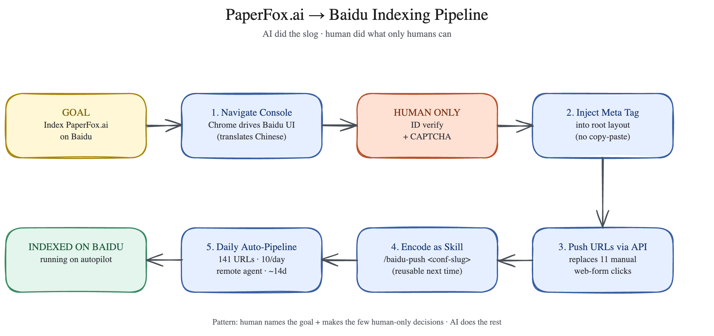

# claude-skill-excalidraw

A fork of the [`excalidraw-diagram-generator`](https://github.com/github/awesome-copilot/tree/main/skills/excalidraw-diagram-generator)
skill from [`github/awesome-copilot`](https://github.com/github/awesome-copilot)
with two additions:

1. **PNG rendering.** The upstream skill outputs `.excalidraw` JSON only,
   which doesn't render in plain Markdown viewers (Obsidian without the
   Excalidraw plugin, GitHub, LinkedIn, etc.). This fork bundles a local
   renderer that produces a faithful hand-drawn PNG using the **actual
   `@excalidraw/excalidraw` library** inside a headless Chromium.
2. **Refined palette + Python helper library.** A small `lib.py` with a
   pale warm/cool palette (`PAL_GOAL`, `PAL_AI`, `PAL_HUMAN`, `PAL_END`,
   `PAL_NEUTRAL`) and building helpers (`rectangle`, `labeled_box`,
   `arrow`, `save_doc`) for diagrams that don't want to read like a
   rainbow.

Everything else — the upstream `SKILL.md`, the 8 diagram-type templates,
the references on the Excalidraw schema and element types, the icon-library
scripts (`add-icon-to-diagram.py`, `add-arrow.py`, `split-excalidraw-library.py`)
— is included **verbatim** from upstream. The two additions are layered
on top, not replacements.



## Install

```bash
git clone https://github.com/harrywang/claude-skill-excalidraw \
  ~/.claude/skills/excalidraw

cd ~/.claude/skills/excalidraw/renderer
npm install
```

The `npm install` step downloads Chromium (~150 MB) once via Puppeteer and
is only needed if you want to render to PNG. The upstream JSON-generation
workflow works without it.

The skill registers itself with Claude Code as `excalidraw-diagram-generator`
(the upstream name preserved in `SKILL.md` frontmatter), so existing prompts
that target the upstream skill continue to work.

## Usage

### Inside Claude Code (intended path)

Prompts that auto-trigger the skill:

- "Create a diagram showing…"
- "Make a flowchart for…"
- "Visualize the process of…"
- "Mind map about…"
- "Pipeline diagram for…"
- "Architecture diagram of…"

The full upstream trigger list and 9 supported diagram types
(flowchart, relationship, mind map, architecture, DFD, swimlane, class,
sequence, ER) are documented in [`SKILL.md`](SKILL.md).

What Claude does:

1. Picks the right diagram type and layout from the request.
2. Either composes the `.excalidraw` JSON directly (upstream path) or
   uses the helpers in [`lib.py`](lib.py) with the refined palette
   (added path).
3. Saves `<descriptive-name>.excalidraw` next to the relevant note.
4. **(added)** Runs `node renderer/render.js …` to produce
   `<descriptive-name>.png` alongside.
5. **(added)** Embeds `![[<descriptive-name>.png]]` in the current note.

### As a standalone tool

You can use the helpers and renderer directly without Claude:

```python
# build_my_diagram.py
import sys, pathlib
sys.path.insert(0, str(pathlib.Path.home() / ".claude/skills/excalidraw"))
from lib import (
    text, labeled_box, arrow, save_doc,
    PAL_GOAL, PAL_AI, PAL_HUMAN, PAL_END, GRAY,
)

elements = []
elements.append(text(40, 30, 1200, "My Pipeline", size=28))
elements += labeled_box(40,  200, 240, 110, ["GOAL", "Start"], PAL_GOAL)
elements += labeled_box(340, 200, 240, 110, ["1. Step", "do thing"], PAL_AI)
elements += labeled_box(640, 200, 240, 110, ["DONE", "result"], PAL_END)
elements.append(arrow(280, 255, 340, 255))
elements.append(arrow(580, 255, 640, 255))
save_doc(elements, "my-diagram.excalidraw")
```

```bash
python3 build_my_diagram.py
node ~/.claude/skills/excalidraw/renderer/render.js my-diagram.excalidraw
# → my-diagram.png
```

For more elaborate diagrams (sequence, ER, class, AWS architecture with
icons), follow the upstream workflow in `SKILL.md`. The bundled
[`templates/`](templates/) and [`scripts/`](scripts/) are inherited from
upstream and work as documented there.

## Why bother forking?

Each path I tried before forking had a gap:

- **Upstream `excalidraw-diagram-generator`** outputs JSON only; without
  the Excalidraw plugin in Obsidian (or the editor at excalidraw.com),
  the file doesn't render.
- **Hand-rolled SVGs** mimic the look but feel sterile — straight lines,
  uniform strokes, none of the warmth.
- **`roughjs` directly** gets close but isn't pixel-identical to what
  Excalidraw produces, and doesn't handle bound text or arrowheads well.
- **`excalidraw_export` on npm** depends on the native `canvas` package
  which fails to compile on modern Node + macOS without extra system
  libraries.

The bundled renderer takes the only path that's both **faithful** and
**reliable**: it loads the real `@excalidraw/excalidraw@0.17.6` ESM bundle
inside a Puppeteer-driven Chromium and calls `exportToBlob()` on your
elements. The output is exactly what excalidraw.com would give you.

## Refined palette

| Palette       | Use                              | bg        | stroke    | title     |
|---------------|----------------------------------|-----------|-----------|-----------|
| `PAL_GOAL`    | Start node / intent              | `#fff7d6` | `#a8860a` | `#7a6207` |
| `PAL_AI`      | Worker / process steps           | `#e6efff` | `#3a5fa3` | `#1d3a72` |
| `PAL_HUMAN`   | Single accent / outlier          | `#ffe1d4` | `#b9522b` | `#7a3416` |
| `PAL_END`     | Terminal / success               | `#e3f5ec` | `#3a8a64` | `#1f5a3e` |
| `PAL_NEUTRAL` | Generic                          | `#f1f3f5` | `#495057` | `#212529` |

Design rule: keep most boxes the same color (usually `PAL_AI`) and reserve
`PAL_HUMAN` (or any contrasting palette) for the **single** outlier you
want the eye to land on. The classic Excalidraw primaries
(`PAL_VIBRANT_YELLOW`, `PAL_VIBRANT_BLUE`, `PAL_VIBRANT_RED`,
`PAL_VIBRANT_GREEN`, `PAL_VIBRANT_PURPLE`) are also exported from
`lib.py` if you prefer the louder original look.

## Repo layout

```
claude-skill-excalidraw/
├── README.md                ← you are here
├── SKILL.md                 ← upstream skill instructions + appendix on PNG/palette
├── LICENSE                  ← MIT (compatible with upstream MIT)
│
├── lib.py                   ← (added) Python helpers + refined palette
├── examples/                ← (added)
│   ├── snake_pipeline.py    ←   worked example using lib.py
│   └── snake_pipeline.png   ←   rendered output (README hero)
├── renderer/                ← (added)
│   ├── render.html          ←   loads @excalidraw/excalidraw from esm.sh
│   ├── render.js            ←   Puppeteer driver, exportToBlob → PNG
│   ├── package.json         ←   single dep: puppeteer
│   ├── .gitignore           ←   excludes node_modules
│   └── README.md
│
├── references/              ← (upstream verbatim) full Excalidraw schema docs
│   ├── element-types.md
│   └── excalidraw-schema.md
├── scripts/                 ← (upstream verbatim) icon-library tooling
│   ├── add-arrow.py
│   ├── add-icon-to-diagram.py
│   ├── split-excalidraw-library.py
│   ├── README.md
│   └── .gitignore
└── templates/               ← (upstream verbatim) starter .excalidraw files
    ├── flowchart-template.excalidraw
    ├── relationship-template.excalidraw
    ├── mindmap-template.excalidraw
    ├── data-flow-diagram-template.excalidraw
    ├── business-flow-swimlane-template.excalidraw
    ├── class-diagram-template.excalidraw
    ├── sequence-diagram-template.excalidraw
    └── er-diagram-template.excalidraw
```

## Editing diagrams later

The `.excalidraw` JSON is the authoritative source. To make changes:

1. Drag the `.excalidraw` file onto [excalidraw.com](https://excalidraw.com).
2. Edit visually.
3. **File → Save** to overwrite the original (it's plain JSON).
4. Re-run `node ~/.claude/skills/excalidraw/renderer/render.js path/to/file.excalidraw`
   to regenerate the PNG.

## Troubleshooting

| Symptom | Fix |
|---|---|
| `Could not find Chromium` | Re-run `npm install` in `renderer/` (or `npx puppeteer browsers install chrome`) |
| Text overflows boxes | Reduce `size` or shorten lines. Three short lines fit cleanly in `240 × 110` |
| Arrows misaligned | Recompute `y = box_y + box_height / 2`; arrow `x` start = `box_x + box_width`, end = next `box_x` |
| Diagram empty / blank | Confirm `npm install` succeeded; rerun with full logs (`node render.js … 2>&1`) |
| First render is slow | Puppeteer downloads Chromium on first run (~150 MB, one-time); next renders are ~3 s |
| Module load timeout | esm.sh CDN occasionally slow — re-run; the bundle gets cached locally after first load |

## License & attribution

MIT — see [`LICENSE`](LICENSE).

Upstream: [`github/awesome-copilot`](https://github.com/github/awesome-copilot)
is also MIT-licensed. The contents of `SKILL.md` (Sections 1–6 and the
upstream `## References`/`## Limitations`/`## Future Enhancements`
sections), `references/`, `scripts/`, and `templates/` are copied verbatim
from there. Only `README.md`, `lib.py`, `examples/`, `renderer/`, and the
`# Additions in this fork` section of `SKILL.md` are original to this repo.
